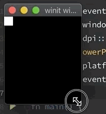

# wgpu-stretch

Minimum repro for this stretching issue:

The shader tries to create a 20x20 square at the top left of the window. This
square should stay the same size even during a resize, but due to unknown
factors, it stretches. :/
